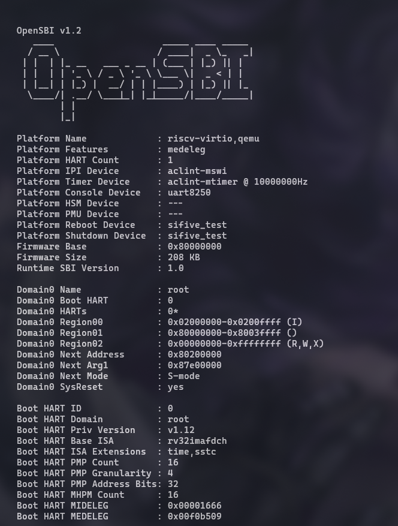

# Writing an Operating System in 1,000 Lines
My implementation of https://operating-system-in-1000-lines.vercel.app/en
A small operating system written from scratch for RISC-V CPU architecture

This project will have basic context switching, paging, user mode, a command-line shell, a disk device driver, and file read/write operations in C.
And also I'll try to add some more functionality to it



# Getting Started
You have to be on UNIS-like OS to run this OS. If you're on Windows you need to install WSL2 (Windows Subsystem for Linux) and follow Ubuntu instructions

## Install tools

### macOS 

Install [Homebrew](https://brew.sh) and run this command to get all tools you need:

```
brew install llvm lld qemu
```

Also, you need to add LLVM binutils to your `PATH`:

```
$ export PATH="$PATH:$(brew --prefix)/opt/llvm/bin"
$ which llvm-objcopy
/opt/homebrew/opt/llvm/bin/llvm-objcopy
```

### Ubuntu

Install packages with `apt`:

```
sudo apt update && sudo apt install -y clang llvm lld qemu-system-riscv32 curl
```

Also, download OpenSBI (think of it as BIOS/UEFI for PCs):

```
curl -LO https://github.com/qemu/qemu/raw/v8.0.4/pc-bios/opensbi-riscv32-generic-fw_dynamic.bin
```

> [!WARNING]
>
> When you run QEMU, make sure `opensbi-riscv32-generic-fw_dynamic.bin` is in your current directory. If it's not, you'll see this error:
>
> ```
> qemu-system-riscv32: Unable to load the RISC-V firmware "opensbi-riscv32-generic-fw_dynamic.bin"
> ```

### Other OS users

If you are using other OSes, get the following tools:

- `bash`: The command-line shell. Usually it's pre-installed.
- `tar`: Usually it's pre-installed. Prefer GNU version, not BSD.
- `clang`: C compiler. Make sure it supports 32-bit RISC-V CPU (see below).
- `lld`: LLVM linker, which bundles complied object files into an executable.
- `llvm-objcopy`: Object file editor. It comes with the LLVM package (typically `llvm` package).
- `llvm-objdump`: A disassembler. Same as `llvm-objcopy`.
- `llvm-readelf`: An ELF file reader. Same as `llvm-objcopy`.
- `qemu-system-riscv32`: 32-bit RISC-V CPU emulator. It's part of the QEMU package (typically `qemu` package).

> [!TIP]
>
> To check if your `clang` supports 32-bit RISC-V CPU, run this command:
>
> ```
> $ clang -print-targets | grep riscv32
>     riscv32     - 32-bit RISC-V
> ```
>
> You should see `riscv32`. Note pre-installed clang on macOS won't show this. That's why you need to install another `clang` in Homebrew's `llvm` package.
